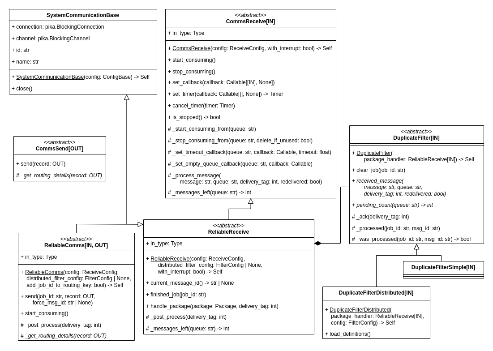
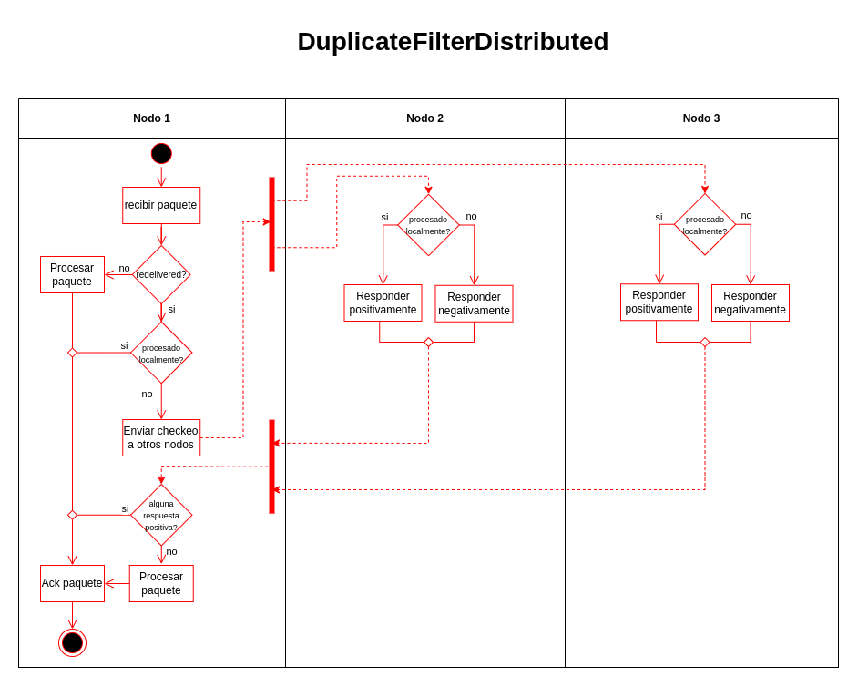
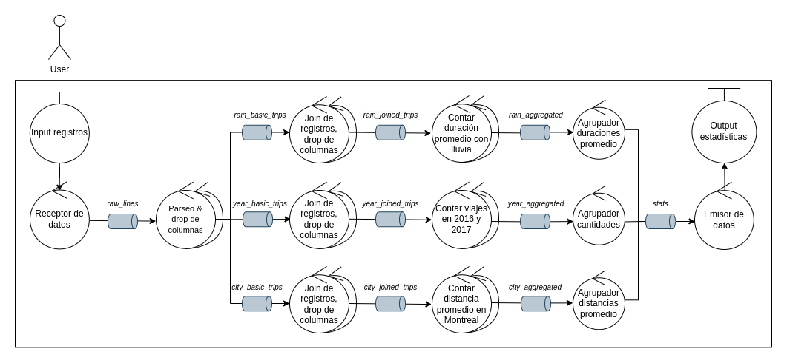
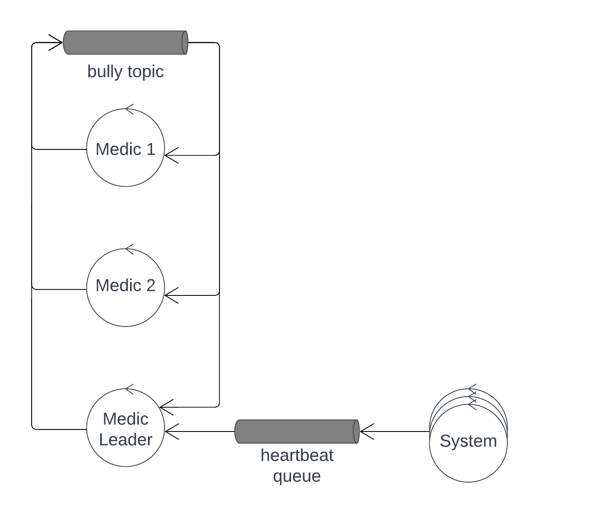

# TP Middleware y Coordinacion - Bike Rides Analyzer

## Scope

Se solicita un sistema distribuido que analice los registros de viajes realizados con bicicletas de la red pública provista por grandes ciudades.

Se requiere obtener:

1. La duración promedio de viajes que iniciaron en días con precipitaciones >30mm.

2. Los nombres de estaciones que al menos duplicaron la cantidad de viajes iniciados en ellas entre 2016 y el 2017.

3. Los nombres de estaciones de Montreal para la que el promedio de los ciclistas recorren más de 6km en llegar a ellas.

Dicha información se debe obtener de registros de clima, estaciones de bicicleta y viajes en bicicleta para las ciudades de Montreal, Toronto y Washington.

## Arquitectura

Para el sistema, se consideraron 6 unidades de desarrollo, cada una la carpeta `src/system`. Todas ellas se connectan por un middleware (RabbitMQ). Estas son:

1. **input**: se conecta a el cliente, utilizando ZeroMQ. Es el punto de entrada de los registros de clima, estaciones y viajes que el sistema debe procesar.
2. **parsers**: recibe mensajes del input, en batches csv como los que le envía el cliente. Parsea los registros de clima, estaciones y viajes, y los envía.
3. **joiners**: reciben los registros parseados y agregan información del clima y estaciones a cada viaje. También quitan alguna información irrelevante para esa pipeline. Hay 3 tipos de **joiners**:
   1. **rain_joiners**: Reciben todos los registros del clima y viajes. Agrega información de precipitaciones al viaje.
   2. **year_joiners**: Reciben los registros de las estaciones y viajes de 2016 y 2017. Agregan a cada viaje el nombre de la estación de inicio.
   3. **city_joiners**: Reciben los registros de las estaciones y viajes de una ciudad específica. Agregan a cada viaje el nombre de la estación de fin y las coordenadas de la estación de inicio y fin.
4. **aggregators**: reciben los viajes con información agregada y los unifican. Hay 3 tipos de **agregators**:
   1. **rain_aggregators**: Reciben los viajes con información de precipitaciones. Calculan la duración promedio de los viajes para cada día que llovió.
   2. **year_aggregators**: Reciben los viajes con información de la estación de inicio. Cuentan la cantidad de viajes por estación para cada año.
   3. **city_aggregators**: Reciben los viajes con información de la estación de fin y las coordenadas de la estación de inicio y fin. Calculan la distancia promedio que se recorre para llegar a cada estación.
5. **reducer**: recibe los registros unificados y los agrupan para obtener la estadística final. Hay 3 tipos de **reducer**:
   1. **rain_reducer**: Recibe los promedios de duración de viajes por día que llovió y los unifica.
   2. **year_reducer**: Recibe la cantidad de viajes por estación para cada año y los unifica. Una vez unificadas todas las cantidades, encuentra las estaciones que duplicaron la cantidad de viajes de un año al otro.
   3. **city_reducer**: Recibe la distancia promedio que se recorre para llegar a cada estación y los unifica. Una vez unificadas todas las distancias promedio, encuentra las estaciones que tienen un promedio mayor a 6km.
6. **output**: sumidero de la información producida los **reducer**. Se conecta al cliente utilizando ZeroMQ y le envía las estadísticas finales cuando llegan y el cliente se lo solicita.
7. **medics**: monitorean el estado de los procesos y los reinician en caso de que fallen. El líder recibe los hearbeats de los otros nodos y los reinicia en caso de que que haya un timeout. Los otros _medics_ reciben heartbeats del líder y llaman a una elección utilizando el algoritmo Bully en caso de que este no responda.

## Objetivos y restricciones de la arquitectura

- El sistema debe estar optimizado para entornos multicomputadoras.
- El sistema debe soportar el incremento de los elementos de cómputo para escalar los volúmenes de información a procesa.
- Se debe proveer _graceful quit_ frente a señales `SIGTERM`.
- El sistema debe mostrar alta disponibilidad hacia los clientes
- El sistema debe ser tolerante a fallos por caídas de procesos
- El sistema debe permitir la ejecución de múltiples análisis en paralelo y/o en secuencia sin reiniciarlo.

## 4+1 vistas

Los diagramas de esta sección se encuentran disponibles para visualizar en [app.diagrams.net](https://app.diagrams.net/?mode=github#Hfdelu%2Fdistribuidos-tp2%2Fmain%2Finforme%2Fdiagramas%2Fdiagramas.xml). El archivo `.xml` utilizado se encuentra en [este repositorio](https://github.com/fdelu/distribuidos-tp1/blob/main/informe/diagramas/diagramas.xml).

### Escenarios

Los casos de uso del sistema son bastante sencillos, y estan muy ligados al Scope descripto en la sección anterior. Se pueden ver en el siguiente diagrama:

|  |
| :---------------------------------: |
|     _Diagrama de Casos de uso_      |

 

### Vista lógica

Para obtener las 3 estadísticas, hay 3 flujos de procesamiento información. Cada uno de ellas se puede ver en el siguiente diagrama:

|  |
| :--------------------: |
|   _Diagrama del DAG_   |

 

El sistema utiliza un middleware (mediante RabbitMQ) para comunicar los procesos. Las clases que se utilizaron para implementar el middleware se pueden ver en el siguiente diagrama de clases:

|  |
| :-----------------------: |
|   _Diagrama de Clases_    |

Salvo los **medics** (que no necesitan comunicación filtro de duplicados), el **input** y el **output** (que solo reciben o envían), todos los nodos utilizan la clase _ReliableComms_ como middleware. Cada nodo tiene su propio módulo de comunicaciones que hereda de _ReliableComms_ para pasarle algunos parámetros específicos.

 

### Vista de procesos

#### StatePersistor

Para guardar el estado, el sistema utiliza una clase llamada **StatePersistor**. Esta clase permite persistir el estado a disco utilizando keys. Cada key se guarda en un archivo distinto. El estado se persisten a disco atómicamente cuando se utiliza el método `save`. Tiene 2 modos:

- `store`-`load`: Guardan y cargan cualquier objeto mediante una key. Al ejecutar `store`, se reemplaza por completo el contenido de esa key con el objeto dado.
- `append`-`iter`: El método `append` permite guardar strings de manera incremental en vez de sobreescribir el estado por completo. El método `iter` permite iterar sobre todas las lineas de esa key. Utiliza el modo `append` al abrir los archivos para escribir solo al final sin tener que reescribirlo por completo

Cuando se ejecuta el método `save`, el sistema guarda en disco todos los cambios realizados (no guarda todo el estado sino solo los cambios) desde el último `save` en una copia secundaria. Luego, se cambia el estado a `"updating"` en un archivo de control de manera atómica (reemplazándolo con un `os.rename`). Se guardan en disco los mismos cambios nuevamente en la copia principal. Finalmente, se cambia al estado a `"commited"` en el archivo de control. Si el sistema se cae, sabe que vale la copia secundaria si el estado es `"updating"` y la copia principal si el estado es `"commited"`, por lo que puede restaurar la otra copia y cargar un estado consistente.

 

#### Filtro de duplicados

El sistema implementa un algoritmo que le permite que cada viaje se procese exactamente una vez. Cada vez que llega un paquete con un batch de mensajes, el sistema:

1. Verifica si el mensaje ya fue procesado con el filtro de duplicados. Si ya fue procesado, se ackea y se descarta.
2. Procesar los viajes. Guardar la id del paquete y cualquier estado en memoria a medida que se procesa. Cualquier mensaje que se tenga que enviar, se bufferea en memoria para enviar mas tarde.
3. Persistir el estado en disco. Esto se hace mediante el método `save` del **StatePersistor**. Las ids de los mensajes procesados se guardan con `append`, al igual que las estaciones y el clima. El resto del estado se guarda con `store`: los estados de diferentes clases y todos los paquetes con envíos pendientes.
4. Ackear el paquete recibido al middleware (RabbitMQ).
5. Enviar los mensajes pendientes.
6. Eliminar del disco los paquetes pendientes ya enviados con el **StatePersistor**.

El sistema, al iniciar, restaura el estado con el **StatePersistor** (lo que le permite restaurar cualquier trabajo en proceso) y envía todos los paquetes pendientes con la flag `maybe_redelivered` en `True`. Esto se hace ya que si el sistema se cae entre los pasos 5 y 6, al reiniciarse volvería a enviar los mensajes que ya fueron enviados. En cambio, si lo hace entre el 4 y 5, no se habían llegado a enviar los mensajes. Si el sistema muere antes del paso 4, RabbitMQ al reenviarlo marcará el mensaje como `redelivered`.

Para implementar el filtro de mensajes duplicados, se utilizaron clases que verifican si un mensaje esta marcado como `redelivered` o si tiene el atributo de `maybe_redelivered=True`. En el caso de los nodos no replicados, utilizan la clase **DuplicateFilterSimple** que solo verifica localmente con la id del mensaje fue procesado (en memoria si fue recientemente, si no lo encuentra pasa a disco). En el caso de los nodos replicados, hacen esto mismo pero además envían un checkeo a los otros nodos. Esto se puede ver en el siguiente diagrama, implementado por la clase **DuplicateFilterDistributed**:

| </img> |
| :------------------------------------------------------------: |
|                   _Diagramas de Actividades_                   |

 

#### Comunicación con el cliente

Para la comunicación con el cliente, se implementó un pequeño protocolo que le permite enviar registros y solicitar los resultados. Hay un módulo **BikeRidesAnalyzer** que actúa como interfaz del sistema para el cliente. El protocolo se puede ver en el siguiente diagrama de secuencia:

> Nota: en este ejemplo el cliente solo solicita un resultado, pero puede solicitar los 3 cuantas veces quiera.

> Nota: si el sistema llego a la máxima cantidad de trabajos en paralelo, o un stat aun no esta disponible, el sistema le responde al cliente con un mensaje de **NotAvailable** para que reintente más tarde.

|  |
| :--------------------------: |
|   _Diagramas de Secuencia_   |

 

#### Monitoreo del sistema

Otro componente muy importante del sistema son los medics, nodos los cuales monitorean el estado de otros nodos mediante heartbeats y los levantan en caso de fallas en alguno de éstos. Los nodos medic también estan replicados para que esta parte del sistema sea tolerante a fallas pero para evitar conflictos se debe elegir a uno de estos nodos como el líder. En el siguiente diagrama se puede ver como los otros nodos monitorean al líder, también mediante heartbeats y en caso de que el líder no responda por un determinado tiempo, los otros medics comienzan una elección para encontrar un nuevo líder y seguir con sus tareas.

|         |
| :-----------------------------------------: |
| _Diagramas de Actividades Líder Heartbeats_ |

Para elegir al nuevo líder se lleva a cabo un algoritmo bully, en el siguiente diagrama se representa el caso en donde el medic 4 que era el líder, falla por lo que los otros medics tienen que elegir otro líder.

|        |
| :--------------------------------------: |
| _Diagramas de Secuencia Algoritmo Bully_ |

Cuando un medic recibe un coordinator message sabe que el emisor es el nuevo líder.

 

### Vista de desarrollo

El código del proyecto esta separado en 3 paquetes:

- **BikeRidesAnalyzer**: La librería del cliente que se conecta al sistema y le solicita los resultados.
- **System**: Contiene los paquetes de cada uno de los nodos del sistema. También hay un paquete `common` que contiene código compartido para la configuración, comunicaciones, definición de mensajes, persistencia, entre otros.
- **Shared**: Paquet de código compartido entre el sistema y la librería del cliente. Contiene las definiciones de los mensajes del protocolo, un módulo de serialización/deserialización, un wrapper sobre el socket de ZeroMQ y un configurador de logs.

Las dependencias entre los paquetes se pueden ver en el siguiente diagrama de paquetes:

|  |
| :-------------------------: |
|   _Diagramas de Paquetes_   |

### Vista Física

Cada servicio del sistema se encuentra contenerizado en un contenedor de Docker. Para la comunicación entre los contenedores se utiliza otro container con RabbitMQ como middleware. Salvo el **Input** y **Output** que también se comunican con el cliente, los servicios solo se comunican a través del middleware. El diagrama de despliegue se puede ver a continuación:

|  |
| :---------------------------: |
|   _Diagrama de Despliegue_    |

En el siguiente diagrama se puede ver como es el flujo de información entre los servicios y su escalabilidad. Los **parsers**, **joiners** y **aggregators** pueden escalarse a una cantidad arbitraria de instancias, lo cual permitiría procesar tantos registros como sea necesario. Los **aggregators** envían resultados parciales a los **reducer** cada un intervalo configurable de tiempo, el cual se puede aumentar si no se procesan lo suficientemente rápido.

|  |
| :-------------------------: |
|   _Diagrama de Robustez_    |

Además el sistema es monitoreado por nodos medics los cuales mediante heartbeats, detectan cuales nodos fallaron y los restaura. El líder se encarga de monitorear a todo el sistema pero los otros medics también son esenciales ya que éstos monitorean al líder en caso de que este falle y además establecen concenso entre sí para elegír un nuevo líder.

| </img> |
| :--------------------------------------------------------: |
|             _Diagrama de Robustez de Médicos_              |

Para más detalles sobre las queues utilizadas en el sistema, recomiendo ver el diagrama _Queues & Exchanges_ en [app.diagrams.net](https://app.diagrams.net/?mode=github#Hfdelu%2Fdistribuidos-tp1%2Fmain%2Finforme%2Fdiagramas%2Fdiagramas.xml). Este diagrama es similar al de robustez pero va en más detalle con los exchanges y queues de RabbitMQ utilizados, los tópicos y tipo de mensajes de cada queue. En ese diagrama, se ejemplificó escalando los nodos de procesamiento a 3 instancias.
